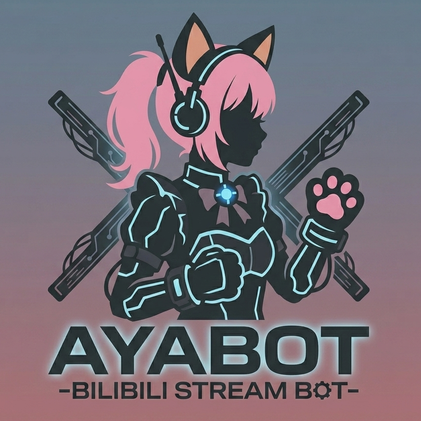

<p align="center">
  
</p>

# ayabot

<p align="center">
  <a href="https://github.com/yujianke100/ayabot/releases"></a>
  <a href="https://github.com/yujianke100/ayabot/pkgs/container/ayabot"></a>
  <a href="https://hub.docker.com/r/yujianke100/ayabot"></a>
  <a href="LICENSE"></a>
</p>

B 站直播间弹幕机器人，支持签到抽签、盲盒统计、AI 对话、自动欢迎/感谢、定时消息、Web 后台管理。
开箱即用，小白友好。纯 Python 跨平台实现，无需 systemd / sudo。

**v0.1.0 新增**：Windows 单文件 .exe 发布版（含托盘图标、日志查看器、自动恢复房间），AI 回复设置持久化。

---

## 初始账号

| 用户名 | 密码 | 说明 |
|--------|------|------|
| `ayabot` | `123456` | 管理员账号，首次登录强制修改密码 |

> 密码忘记或想重置？运行 `python -m app.reset_admin` 即可重置为随机密码。
> Windows .exe 版：右键托盘图标 → **重置管理员密码**（重置为 123456）。

---

## 🚀 快速上手

### 🪟 Windows 用户（推荐）

下载 `Ayabot.exe` 后直接双击运行，无需 Python 环境：

```
Ayabot.exe 单独一个文件，双击即运行
├── 托盘图标（右下角）
│   ├── 🌐 打开管理后台
│   ├── 🔌 设置端口
│   ├── 🔑 重置管理员密码
│   ├── 📋 查看日志（级别筛选）
│   └── ❌ 退出
├── 端口管理（持久化，默认 19810）
├── 房间状态持久化（退出时保存运行中的房间，启动自动恢复）
└── 配置和数据 → %LOCALAPPDATA%\Ayabot\
```

> 首次启动自动从 exe 中释放默认配置。浏览器打开 `http://localhost:19810`。

### 🐍 用 Python 直接跑（推荐开发）

```bash
git clone https://github.com/yujianke100/ayabot.git
cd ayabot
pip install -r requirements.txt
cp config.example.yaml config.yaml
# 编辑 config.yaml：填直播间号和主播 UID

# 启动 Web 管理后台（内置 Bot 进程管理器）
python web_serve.py
```

浏览器打开 `http://localhost:19810` 进入 Web 后台，在「B站账号」扫码登录，然后在「房间管理」中创建房间、启动机器人。

> **端口被占用了？** `python web_serve.py --port 你想要的端口号` 或 `AYABOT_PORT=你想要的端口号 python web_serve.py`

### 🐳 或用 Docker 跑

```bash
mkdir ayabot && cd ayabot
wget https://raw.githubusercontent.com/yujianke100/ayabot/main/config.example.yaml -O config.yaml
wget https://raw.githubusercontent.com/yujianke100/ayabot/main/docker-compose.yml -O docker-compose.yml
# 编辑 config.yaml，填直播间号和主播 UID
mkdir -p data rooms accounts
docker compose up -d
```

容器运行 WebUI（端口 19810），Bot 子进程由 WebUI 内建的 ProcessManager 自动管理。
浏览器打开 `http://localhost:19810`。

> **改端口？** 编辑 `docker-compose.yml`，修改 `ports` 左侧值和 `AYABOT_PORT` 环境变量。
> 例如 Nginx 反向代理用 8000 → 容器内 19810：`"8000:19810"` + `AYABOT_PORT=19810`

---

## 🛠️ 命令行工具

### 重置管理员密码

```bash
# 重置为随机密码（自动生成并打印）
python -m app.reset_admin

# 重置为指定密码
python -m app.reset_admin --password mypass

# 重置指定用户
python -m app.reset_admin --username ayabot --password mypass

# 重置但不强制首次改密码
python -m app.reset_admin --no-reset-flag
```

### 环境变量

| 变量 | 默认值 | 说明 |
|------|--------|------|
| `AYABOT_PORT` | `19810` | Web 管理后台监听端口。**启动前设置**，避免端口冲突进不去后台 |

---

## 🎯 直播间弹幕命令

在直播间发以下指令，机器人自动回复：

| 发这个 | 机器人会 |
|--------|----------|
| `#签到` | 签到 + 显示连续天数 + 排名 |
| `#抽签` | 今日运势 |
| `#今日盲盒[:用户名]` | 统计自己或指定用户今日盲盒 |
| `#本月盲盒[:用户名]` | 本月盲盒汇总 |
| `#ayabot <说点啥>` | AI 聊天（唤醒词可在后台修改） |
| `#帮助` | 列出所有命令 |

> 中文 `#` 和英文 `#` 都行，`＃签到` 也能识别。
> 开启「免#指令」后，不带 `#` 前缀也能触发（如直接发「签到」）。
> 开启「AI免#前缀唤醒」后，弹幕以唤醒词开头即触发 AI 回复。

---

## ⚙️ Web 管理后台

浏览器打开 `http://你的IP:19810` 进入后台（初始账号 `ayabot` / `123456`，首次登录强制修改）。

> 首次登录后可在右上角修改用户名和密码，状态持久化，重启不丢失。

| 页面 | 能干嘛 |
|------|--------|
| 📊 **送礼排行** | 按日期看谁送了多少礼物/盲盒，带柱状图 |
| 🎨 **精美导出** | 导出送礼明细卡片，可直接打印或截图 |
| 🤖 **AI 回复** | 开关、改唤醒词、配 API Key、调温度、改人设。支持三种触发方式 |
| ⚙️ **机器人配置** | 功能开关、冷却时间、弹幕限流、欢迎/感谢/盲盒模板、定时消息、关键词回复、签文 |
| 👥 **用户管理** | 管理员增删改查、B站账号登录/验证 |
| 💬 **弹幕记录** | 查看直播间历史弹幕 |
| 🗑️ **数据管理** | 清理旧数据 |

### 功能开关

| 功能 | 说明 |
|------|------|
| 免#指令 | 不带 `#` 也能触发签到、盲盒等指令 |
| AI免#前缀唤醒 | 弹幕以唤醒词开头即触发 AI 回复 |
| 包含关键词触AI | 弹幕任何位置含唤醒词即触发 AI 回复 |
| 弹幕记录 | 开启后记录所有弹幕到数据库，可在 Web 查看 |
| 大航海欢迎/感谢 | 舰长/提督/总督专属模板 |
| 自定义签文 | 修改抽签结果的六种签文内容 |
| 盲盒统计（今日/本月） | 区分今日和本月的盲盒统计，支持自定义回复文本 |

### 关键词回复

支持：
- **包含匹配** / **精确匹配**
- 可限制仅特定 UID 触发
- 可配置冷却时间
- **模态框编辑**，与 UID 特定欢迎模板风格一致

---

## 📝 配置说明

```yaml
room_display_id: 1946287911        # ← 改成你的直播间号
anchor_uid: 1000000                # ← 改成主播的 UID
```

> 用户名密码不写在配置里，初始密码见上方表格，也可通过 `python -m app.reset_admin` 随时重置。
> 所有配置均可通过 Web 后台修改，无需手动编辑 YAML。

完整的配置示例见 [config.example.yaml](config.example.yaml)。

---

## 💾 数据与进程管理

| 文件/目录 | 说明 |
|-----------|------|
| `rooms/<id>/data/bot.db` | 房间独立 SQLite 数据库 |
| `rooms/<id>/bot.pid` | Bot 进程 PID 文件 |
| `rooms/<id>/bot.log` | Bot 运行日志 |
| `rooms/<id>/config.yaml` | 房间专属配置 |
| `accounts/<uid>/credential.json` | B 站扫码登录凭据 |
| `data/users.json` | WebUI 用户账号 |
| `data/templates.json` | 预设模板 |

### 跨平台进程管理

纯 Python 实现（`app/process_manager.py`），自动适配运行模式：

- **普通 Python 环境**：`subprocess.Popen` 子进程管理 Bot
- **PyInstaller 冻结模式**（.exe）：同进程 asyncio Task 运行 Bot（无需子进程）
- **无需 systemd / sudo / root**，Linux / macOS / Windows 通用
- **Docker 环境**同样适用，Bot 由 WebUI 内建管理器自动控制

### 房间自动恢复

Windows .exe 版退出时会保存运行中的房间列表，下次启动自动恢复。
无需手动重新启动每个房间。

---

## 🐳 Docker 镜像

自动构建推送到 GitHub Container Registry 和 Docker Hub：

```bash
# GitHub Container Registry（主镜像）
docker pull ghcr.io/yujianke100/ayabot:latest

# Docker Hub（备用）
docker pull yujianke100/ayabot:latest
```

容器启动后即可在 WebUI 中管理机器人。
完整部署步骤见上方的 [快速上手 → 用 Docker 跑](#-快速上手)。

### 🇨🇳 国内镜像加速

ghcr.io 国内拉取可能很慢，推荐以下方式：

**方式一：通过 ghcr.io 镜像站拉取**

```bash
# 中科大 ghcr.io 镜像
docker pull docker.mirrors.ustc.edu.cn/ghcr.io/yujianke100/ayabot:latest

# 网易 ghcr.io 镜像
docker pull hub-mirror.c.163.com/ghcr.io/yujianke100/ayabot:latest
```

**方式二：查询最新可用镜像站**
→ [demo.kentxxq.com/app/mirror](https://demo.kentxxq.com/app/mirror)（实时检测国内各镜像站可用性）

---

## 🪟 Windows .exe 构建与发布

### 从源码构建

```bash
pip install pyinstaller pystray pillow
python scripts/build_exe.py
```

构建产物输出在 `dist/Ayabot.exe`，约 60 MB。

### 嵌入的资源

exe 包含以下内容，启动时自动释放到 `%LOCALAPPDATA%\Ayabot\`：
- `config.example.yaml`（作为默认配置模板，首次启动自动复制）
- `icon.png`（托盘图标）

运行所需的数据目录结构：

```
%LOCALAPPDATA%\Ayabot\
├── config.yaml        ← 自动从 exe 释放（可自行修改）
├── ayabot.log         ← 自动轮转，最多保留 5000 行
├── port.txt           ← 端口持久化
├── running_rooms.json ← 运行中的房间列表
└── data\
    ├── users.json     ← 用户账号
    ├── templates.json ← 预设模板
    └── bot.db         ← 全局数据库
```

### 托盘功能

| 菜单 | 说明 |
|------|------|
| 🌐 **打开管理后台** | 浏览器打开 WebUI |
| 🔌 **设置端口** | 修改监听端口（默认 19810） |
| 🔑 **重置管理员密码** | 重置为 123456 |
| 📋 **查看日志** | 级别筛选、自动刷新、自动滚动、深色主题 |
| ❌ **退出** | 保存运行中的房间后退出 |

---

## 📄 License

MIT
